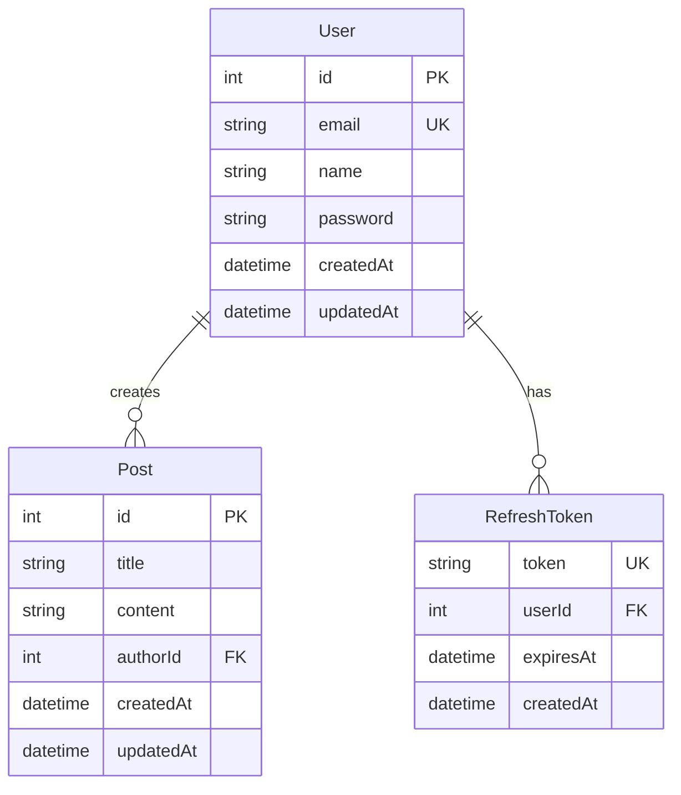

# NestJS CRUD Application

## 📝 Mô tả

Đây là một ứng dụng RESTful API được xây dựng với NestJS framework, cung cấp các chức năng CRUD (Create, Read, Update, Delete) cơ bản cho hệ thống quản lý bài viết (Posts) và người dùng (Users) với xác thực JWT.

## ✨ Tính năng

- 🔐 **Authentication & Authorization**: Hệ thống xác thực JWT với Refresh Token
- 📝 **Posts Management**: Quản lý bài viết (CRUD operations)
- 👥 **User Management**: Quản lý người dùng
- 🗄️ **Database Design**: Thiết kế cơ sở dữ liệu với Prisma ORM
- ✅ **Validation**: Validation dữ liệu với class-validator và class-transformer
- 🧪 **Testing**: Unit tests và E2E tests

## 🏗️ Database Schema

Dự án sử dụng SQLite với Prisma ORM. Dưới đây là sơ đồ cơ sở dữ liệu:



### Mối quan hệ

- **Post → User**: Mỗi bài viết thuộc về một người dùng (nhiều-một). Khi xóa user thì xóa tất cả posts của user đó (cascade delete)
- **RefreshToken → User**: Mỗi refresh token thuộc về một người dùng. Khi xóa user thì xóa tất cả tokens của user đó (cascade delete)

## 🚀 Cài đặt

```bash
# Clone repository
$ git clone <repository-url>

# Cài đặt dependencies
$ npm install

# Setup Prisma database
$ npx prisma generate
$ npx prisma migrate dev --name init

# Seed database (optional)
$ npx prisma db seed
```

## 💻 Chạy ứng dụng

```bash
# Development mode
$ npm run start

# Watch mode (tự động restart khi có thay đổi)
$ npm run start:dev

# Production mode
$ npm run start:prod
```

## 🧪 Chạy tests

```bash
# Unit tests
$ npm run test

# E2E tests
$ npm run test:e2e

# Test coverage
$ npm run test:cov
```

## 📚 API Endpoints

### Posts

- `GET /posts` - Lấy danh sách tất cả bài viết
- `GET /posts/:id` - Lấy thông tin một bài viết
- `POST /posts` - Tạo bài viết mới
- `PATCH /posts/:id` - Cập nhật bài viết
- `DELETE /posts/:id` - Xóa bài viết

## 🛠️ Tech Stack

- **Framework**: NestJS 11.x
- **Language**: TypeScript
- **Runtime**: Node.js 20.19.4
- **Database**: SQLite
- **ORM**: Prisma 7.3.0
- **Database Adapter**: better-sqlite3
- **Validation**: class-validator, class-transformer
- **Testing**: Jest
- **Script Runner**: tsx (TypeScript execution)

## 📁 Cấu trúc thư mục

```
src/
├── posts/              # Module quản lý bài viết
│   ├── posts.controller.ts
│   ├── posts.service.ts
│   ├── posts.dto.ts
│   └── posts.module.ts
├── app.module.ts       # Root module
├── app.controller.ts
├── app.service.ts
└── main.ts            # Entry point
```

## 📝 Files quan trọng

- `designdb.dbml` - Database Markup Language schema
- `designdb.dbdiagram` - Database diagram configuration
- `prisma/schema.prisma` - Prisma schema với User, Post, RefreshToken models
- `script.ts` - Script demo tạo dữ liệu với Prisma Client
- `mise.toml` - Node.js version management (20.19.4)

## 🔧 Prisma Commands

```bash
# Generate Prisma Client
$ npx prisma generate

# Create migration
$ npx prisma migrate dev --name <migration-name>

# Reset database (development only!)
$ npx prisma migrate reset

# Open Prisma Studio (database GUI)
$ npx prisma studio

# Check migration status
$ npx prisma migrate status
```
